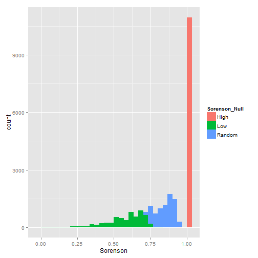

Comparison of Trait Metrics - Z.scores versus unstandardized
========================================================

Three morphological traits for 141 hummingbird species - Bill Size (mm), Mass (g), WingChord(mm)

Import Data
-----------

```r
require(vegan)
# bring in traits
morph <- read.csv("C:\\Users\\Jorge\\Dropbox\\Lab paper 1 Predicted vs observed assemblages\\MorphologyShort.csv", 
    na.strings = "9999")

# just get males
morph.male <- morph[morph$Sex == "Macho", c("SpID", "ExpC", "Peso", "AlCdo")]
morph.complete <- morph.male[complete.cases(morph.male), ]

# aggregate for species
agg.morph <- aggregate(morph.complete, list(morph.complete$SpID), mean)
mon <- agg.morph[, -2]
colnames(mon) <- c("Species", "Bill", "Mass", "WingChord")
rownames(mon) <- mon[, 1]
mon <- mon[, -1]

# Replace spaces with underscore
rownames(mon) <- gsub(" ", "_", rownames(mon))
head(mon)
```

```
##                           Bill  Mass WingChord
## Adelomyia_melanogenys    15.04 4.245     55.87
## Aglaeactis_cupripennis   18.71 8.440     85.62
## Aglaiocercus_coelestis   16.25 6.070     68.68
## Aglaiocercus_kingi       15.77 5.530     67.12
## Amazilia_amazilia        18.54 4.070     53.33
## Amazilia_castaneiventris 18.70 4.750     52.70
```


Euclidean Distance 
------------------


```r
d.euclid <- dist(mon, method = "euclidean")
```


PCA Distance
-------------------------
*trivial in this case since i'll use all loading axis, but 
useful for more traits

```r
# pca
pca.t <- prcomp(mon)

# dist of the loading axis
d.pca <- dist(pca.t$x, method = "euclidean")
```


Standardized Euclidean Z score
-------------------------------


```r
# subtract the means off each column and divide by sd
means <- apply(mon, 2, mean)

Bill <- mon$Bill - means["Bill"]/sd(mon$Bill)
Mass <- mon$Mass - means["Mass"]/sd(mon$Mass)
WingChord <- (mon$WingChord - means["WingChord"])/sd(mon$WingChord)

z.scores <- data.frame(Bill, Mass, WingChord)
rownames(z.scores) <- rownames(mon)

d.zscores <- dist(z.scores, method = "euclidean")
```


Trait Dendrogram - Complete Linkage
---------------------------------------------


```r
require(ape)
```

```
## Loading required package: ape
```

```r
trait.d <- as.phylo(hclust(d.zscores, method = "complete"))
trait.ward <- as.phylo(hclust(d.zscores, method = "ward"))

d.dend <- cophenetic(trait.d)
d.dend.ward <- cophenetic(trait.ward)
```


Compare euclidean dist and zscores
---------


```r
require(GGally)
require(ggplot2)

# First three methods are the same?
mantel(d.euclid, d.pca)
```

```
## 
## Mantel statistic based on Pearson's product-moment correlation 
## 
## Call:
## mantel(xdis = d.euclid, ydis = d.pca) 
## 
## Mantel statistic r:    1 
##       Significance: 0.001 
## 
## Upper quantiles of permutations (null model):
##    90%    95%  97.5%    99% 
## 0.0569 0.0987 0.1470 0.1757 
## 
## Based on 999 permutations
```

```r
mantel(d.pca, d.zscores)
```

```
## 
## Mantel statistic based on Pearson's product-moment correlation 
## 
## Call:
## mantel(xdis = d.pca, ydis = d.zscores) 
## 
## Mantel statistic r: 0.656 
##       Significance: 0.001 
## 
## Upper quantiles of permutations (null model):
##    90%    95%  97.5%    99% 
## 0.0674 0.0924 0.1457 0.2282 
## 
## Based on 999 permutations
```


Compare dendrogram methods
---------


```r

# Trait dendrogram methods compared to each other
mantel(d.dend, d.dend.ward)
```

```
## 
## Mantel statistic based on Pearson's product-moment correlation 
## 
## Call:
## mantel(xdis = d.dend, ydis = d.dend.ward) 
## 
## Mantel statistic r: 0.701 
##       Significance: 0.001 
## 
## Upper quantiles of permutations (null model):
##    90%    95%  97.5%    99% 
## 0.0344 0.0457 0.0579 0.0652 
## 
## Based on 999 permutations
```

```r

# Compare Trait dendrogram to euclid
mantel(d.dend, d.euclid)
```

```
## 
## Mantel statistic based on Pearson's product-moment correlation 
## 
## Call:
## mantel(xdis = d.dend, ydis = d.euclid) 
## 
## Mantel statistic r: 0.48 
##       Significance: 0.001 
## 
## Upper quantiles of permutations (null model):
##    90%    95%  97.5%    99% 
## 0.0510 0.0759 0.0904 0.1294 
## 
## Based on 999 permutations
```

```r


compa <- list(d.euclid, d.pca, d.zscores, d.dend)
names(compa) <- c("Euclidean", "PCA", "Z.scores", "Complete.Dendrogram")

# Turn into a sparse matrix
compmat <- lapply(compa, function(x) {
    j <- as.matrix(x)
    j[upper.tri(j)] <- NA
    diag(j) <- NA
    return(j)
})

# melt to a dataframe and plot
dat <- melt(compmat)
dat.cast <- cast(na.omit(dat), X1 + X2 ~ L1)
```


Plot what we've learned
=============================
1.Unstandardized Distances are Biased compared to zscores
---------------------------------------------------------------------


2.Trait dendrogram is a reasonable approximation for data structure -Its the very 
-----------------------------------------------------------------------------
unrelated taxa that are most difficult to force into a structure. 
-------------------------------------------------------------------------

```r

# Euclid Methods
ggplot(dat.cast, aes(Euclidean, Z.scores)) + geom_point()
```

 

```r

# Euclid v Complete Linkage
ggplot(dat.cast, aes(Z.scores, Complete.Dendrogram)) + geom_point()
```

 

```r

```

