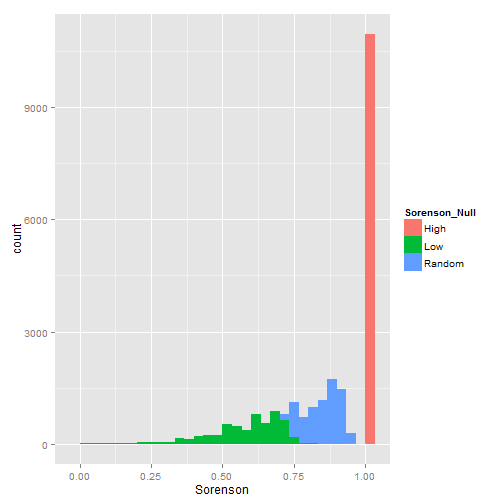
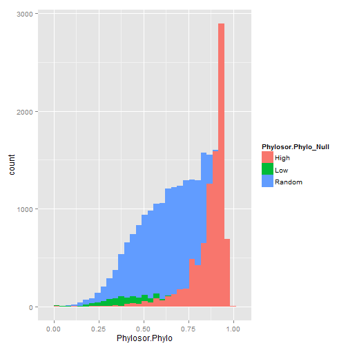
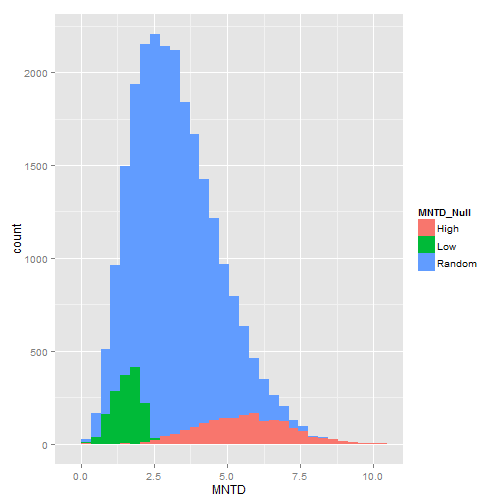

Observed versus Null Deliniations of Betadiversity
---------------------

Reviewer stated,

*"I therefore proposed to first distinguish between low and high values of CBD (or PBD or TBD) based on observed values and not based on the null model (e.g., observed TBD>0.7 = high, observed TBD<0.3 = low). For these observed low or high values of CBD (and PBD and TBD), you can run a null model to test (1) whether the high observed values are significantly greater than expected by chance and (2) whether the low observed values are significantly lower than expected by chance. Then, you can conclude according to your framework (8 combinations)."*

The reviewer has been very helpful throughout the development of this manuscript, so i want to fully explore the differences in the two approaches.

What is the relationship between null and observed quantiles of diversity?
===========


**Contingency Table (% of Assemblages) for the two approaches**
---------

**Columns are observed values of betadiversity (High >.7), (Low < .3)**

**Rows are null values where high is delinated by comparing the observed betadiversity to 1000 assemblage comparison of equal richnes (alpha =.05)**

Taxonomic Betadiversity
------------------------
<!-- html table generated in R 3.0.2 by xtable 1.7-1 package -->
<!-- Wed Feb 05 22:52:59 2014 -->
<TABLE border=1>
<TR> <TH>  </TH> <TH> Low </TH> <TH> Random </TH> <TH> High </TH> <TH> Sum </TH>  </TR>
  <TR> <TD align="right"> High </TD> <TD align="right"> 0.00 </TD> <TD align="right"> 0.00 </TD> <TD align="right"> 46.00 </TD> <TD align="right"> 46.00 </TD> </TR>
  <TR> <TD align="right"> Low </TD> <TD align="right"> 0.72 </TD> <TD align="right"> 19.53 </TD> <TD align="right"> 2.89 </TD> <TD align="right"> 23.14 </TD> </TR>
  <TR> <TD align="right"> Random </TD> <TD align="right"> 0.00 </TD> <TD align="right"> 0.02 </TD> <TD align="right"> 30.84 </TD> <TD align="right"> 30.86 </TD> </TR>
  <TR> <TD align="right"> Sum </TD> <TD align="right"> 0.72 </TD> <TD align="right"> 19.55 </TD> <TD align="right"> 79.73 </TD> <TD align="right"> 100.00 </TD> </TR>
   </TABLE>


Table reads, 2.89% of the total assemblages are in the 'high' observed quantile, but 'low' compared to a null model of richness. The difference in low taxonomic betadiversity is due assemblages have greater than sorenson =.3, but having less taxonomic betadiversity compared to 1000 assemblage comparisons maintaining richness.

Phylogenetic Betadiversity
------------------------

**Columns are observed values of betadiversity (High >.7), (Low < .3)**

**Rows are null values where high is delinated by comparing the observed betadiversity to 1000 assemblage comparison of equal taxonomic betadiversity (alpha =.05)**

<!-- html table generated in R 3.0.2 by xtable 1.7-1 package -->
<!-- Wed Feb 05 22:52:59 2014 -->
<TABLE border=1>
<TR> <TH>  </TH> <TH> Low </TH> <TH> Random </TH> <TH> High </TH> <TH> Sum </TH>  </TR>
  <TR> <TD align="right"> High </TD> <TD align="right"> 0.06 </TD> <TD align="right"> 2.57 </TD> <TD align="right"> 34.71 </TD> <TD align="right"> 37.34 </TD> </TR>
  <TR> <TD align="right"> Low </TD> <TD align="right"> 0.69 </TD> <TD align="right"> 2.55 </TD> <TD align="right"> 0.00 </TD> <TD align="right"> 3.24 </TD> </TR>
  <TR> <TD align="right"> Random </TD> <TD align="right"> 1.83 </TD> <TD align="right"> 37.92 </TD> <TD align="right"> 19.68 </TD> <TD align="right"> 59.42 </TD> </TR>
  <TR> <TD align="right"> Sum </TD> <TD align="right"> 2.57 </TD> <TD align="right"> 43.04 </TD> <TD align="right"> 54.39 </TD> <TD align="right"> 100.00 </TD> </TR>
   </TABLE>


Table reads, 0.06% of the total assemblages are in the 'low' observed quantile, but 'high' compared to a null model of taxonomic.

Trait Betadiversity
------------------------

**Columns are observed values of betadiversity (High >quantile(.7)), (Low < quantile(.3))** 

**Rows are null values where high is delinated by comparing the observed betadiversity to 1000 assemblage comparison of equal taxonomic betadiversity (alpha =.05)**

<!-- html table generated in R 3.0.2 by xtable 1.7-1 package -->
<!-- Wed Feb 05 22:52:59 2014 -->
<TABLE border=1>
<TR> <TH>  </TH> <TH> Low </TH> <TH> Random </TH> <TH> High </TH> <TH> Sum </TH>  </TR>
  <TR> <TD align="right"> High </TD> <TD align="right"> 0.07 </TD> <TD align="right"> 1.06 </TD> <TD align="right"> 6.22 </TD> <TD align="right"> 7.35 </TD> </TR>
  <TR> <TD align="right"> Low </TD> <TD align="right"> 6.16 </TD> <TD align="right"> 0.06 </TD> <TD align="right"> 0.00 </TD> <TD align="right"> 6.22 </TD> </TR>
  <TR> <TD align="right"> Random </TD> <TD align="right"> 23.77 </TD> <TD align="right"> 38.88 </TD> <TD align="right"> 23.78 </TD> <TD align="right"> 86.43 </TD> </TR>
  <TR> <TD align="right"> Sum </TD> <TD align="right"> 30.00 </TD> <TD align="right"> 40.00 </TD> <TD align="right"> 30.00 </TD> <TD align="right"> 100.00 </TD> </TR>
   </TABLE>


Table reads, 0.07% of the total assemblages are in the 'low' observed quantile, but 'high' compared to a null model of taxonomic.

Distribution of Observed and Null


```
## stat_bin: binwidth defaulted to range/30. Use 'binwidth = x' to adjust this.
```

 

```
## stat_bin: binwidth defaulted to range/30. Use 'binwidth = x' to adjust this.
```

 

```
## stat_bin: binwidth defaulted to range/30. Use 'binwidth = x' to adjust this.
```

 


Perhaps one way forward to avoid the terms "High" and "Low" and refer directly to what we mean(eg. Greater than expected phylogenetic betadiversity given the taxonomic betadiversity.) 
