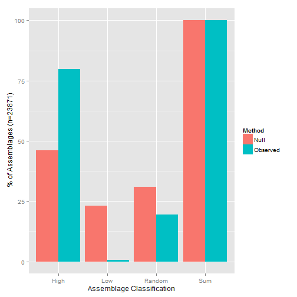

Observed versus Null Deliniations of Taxonomic Betadiversity
---------------------

Reviewer stated,

*"I therefore proposed to first distinguish between low and high values of CBD (or PBD or TBD) based on observed values and not based on the null model (e.g., observed TBD>0.7 = high, observed TBD<0.3 = low). For these observed low or high values of CBD (and PBD and TBD), you can run a null model to test (1) whether the high observed values are significantly greater than expected by chance and (2) whether the low observed values are significantly lower than expected by chance. Then, you can conclude according to your framework (8 combinations)."*

The reviewer has been very helpful throughout the development of this manuscript, so i want to fully explore the differences in the two approaches.

What is the relationship between null and observed quantiles of diversity?
===========


**Contingency Table (% of Assemblages) for the two approaches**
<!-- html table generated in R 3.0.2 by xtable 1.7-1 package -->
<!-- Mon Feb 03 16:02:47 2014 -->
<TABLE border=1>
<TR> <TH>  </TH> <TH> Low Observed </TH> <TH> Random Observed </TH> <TH> High Observed </TH> <TH> Sum Observed </TH>  </TR>
  <TR> <TD align="right"> High Null </TD> <TD align="right"> 0.00 </TD> <TD align="right"> 0.00 </TD> <TD align="right"> 46.00 </TD> <TD align="right"> 46.00 </TD> </TR>
  <TR> <TD align="right"> Low Null </TD> <TD align="right"> 0.72 </TD> <TD align="right"> 19.53 </TD> <TD align="right"> 2.89 </TD> <TD align="right"> 23.14 </TD> </TR>
  <TR> <TD align="right"> Random Null </TD> <TD align="right"> 0.00 </TD> <TD align="right"> 0.02 </TD> <TD align="right"> 30.84 </TD> <TD align="right"> 30.86 </TD> </TR>
  <TR> <TD align="right"> Sum Null </TD> <TD align="right"> 0.72 </TD> <TD align="right"> 19.55 </TD> <TD align="right"> 79.73 </TD> <TD align="right"> 100.00 </TD> </TR>
   </TABLE>

Table reads, 2.89% of the total assemblages are in the 'high' observed quantile, but 'low' compared to a null model of richness.


Number of Univariate Assemblage Comparisons
================================

```r
require(reshape)
```

```
## Loading required package: reshape
## Loading required package: plyr
## 
## Attaching package: 'reshape'
## 
## The following objects are masked from 'package:plyr':
## 
##     rename, round_any
```

```r
cont_PM <- melt(cont_P)
colnames(cont_PM) <- c("Null", "Observed", "Percentage")
toplot <- melt(cont_PM, id.var = "Percentage")

ggplot(toplot, aes(x = value, y = Percentage, fill = variable)) + geom_bar(stat = "identity", 
    position = "dodge") + labs(x = "Assemblage Classification", y = (" % of Assemblages (n=23871)"), 
    fill = "Method")
```

 


Why use a null model
-------

We use a null model to compare our observed patterns to a expectated set of values, given the randomization of a defined parameter. The reviewer of course knows this, and i hope i can illustrate the subletly of the argument. As with many null models, its most important to define what is being randomized and why. I have no doubt that the reviewer fully comprehends the extension show below (his/her contribution to this work demonstrates a keen understanding of the topic), but i think it is important to illustrate completely with our data. 

Bias of the Sorenson index
========


```r
load(paste(droppath, "Shared Ben and Catherine/DimDivRevision/Results/DimDivRevision.RData", 
    sep = ""))

# Get the assemblage size for
data.df$To_N <- sapply(data.df$To, function(x) {
    length(Getsplist(x))
})

data.df$From_N <- sapply(data.df$From, function(x) {
    length(Getsplist(x))
})
ggplot(data.df, )
```

```
## Error: No layers in plot
```
